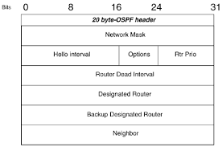

# 🌐 Le protocole OSPF

## Présentation

### Définition
    
???+info "Définition"
    |Protocole OSPF||
    |:---------------------:|:-:|
    ```mermaid              
    flowchart RL 
    1{R1} --- 2(R2)
    2 --- 4[(R4)]
    1 --- 3(R3) --- 5
    4 --- 5[/R5\]
    subgraph g1 [Aire 1]
    1
    2
    3
    4
    5
    end
    
    R6 --- R7 --- R9
    R8 --- R9
    g2 --- g1

    subgraph g2 [Aire 2]
    R6
    R7
    R8
    R9
    end


    ```                     
    |Créé en **1997**[^an] Le **Protocole OSPF** est un protocole de routage de données créé pour remplacer le protocole RIP. Pour ça, il crée des aires où se regroupent plusieurs routeurs. Ensuite, il isole chacunes des aires, et au sein de chacunes, cartographie les meilleurs routes pour chaque sortie grâce à un message `hello` envoyé à tous les appareils de l'aire. Après il lui suffit de savoir quels aires sont connectées a quelles aires afin de transporter les paquets. |

    Wikipedia[^wiki1]

*[OSPF]: Open Shortest Path First
[^an]: [RFC1247](https://www.rfc-editor.org/rfc/rfc1247)
[^wiki1]: [Wikipedia: Open Shortest Path First](https://fr.wikipedia.org/wiki/Open_Shortest_Path_First)

### Spécificités techniques

???+TLDR "Spécificités techniques"
    
    ???+note "Spécificités techniques"
        
        |1|2|3|
        |:-:|:-:|:-:|
        |Le protocole établit des aires avec plusieurs routeurs regroupés|Chaque aire établient les meilleures routes vers les sorties avec les messages `hello`|Prend en compte, le nombre de sauts, la vitesse du réseau|
        |**4**|**5**|**6**|
        |Peut diviser la charge sur plusieurs routes à la fois|Sauts illimités|Plus optimisé pour application de grande ampleur|

    ???+info "En-tête OSPF"
        
        { align=center }

## Application du protocole

### Cas 1

???+example "Cas 1"
    ???+info "Situation"
        Nous avons un packet de données qui doit aller du routeur **R1** au routeur **R17**. Quelle route va emprunter le paquet de données ? (Toutes les connexions sont à 1 Gbits/s)
    
    === "Base"
        ???+question "Cas de base"
        
            ```mermaid
            flowchart TB

            subgraph A1 [Aire 1]
                R1{R1}
                R1 ---|1Gbits/s| R3
                R1 ---|1Gbits/s| R2
                R2 ---|1Gbits/s| R4
                R4 ---|1Gbits/s| R5 
                R3 ---|1Gbits/s| R5
            end

            subgraph A2 [Aire 2]
                R7 ---|1Gbits/s| R8
                R8 ---|1Gbits/s| R9
            end


            subgraph A3 [Aire 3]
                R11 ---|1Gbits/s| R12
                R12 ---|1Gbits/s| R14
                R11 ---|1Gbits/s| R13
            end


            subgraph A4 [Aire 4]
                R17 ---|1Gbits/s| R15 
                R15 ---|1Gbits/s| R16
                R16 ---|1Gbits/s| R17
            end

            R5 === R9
            R7 === R13
            R11 === R15
            R7 === R17

            style R1 fill:#BF0000,stroke:#000,stroke-width:4px,color:#fff
            style R17 fill:#0000FF,stroke:#000,stroke-width:4px,color:#fff
            ```

    === "étape 1"
        ???+info "Information"
            Il faut déjà regarder à l'échelle des aires: ici, nous irons via: `aire 1 -> aire 2 -> aire 4`

        ???+question "étape 1"
 
            ```mermaid
            flowchart TB

            subgraph A1 [Aire 1]
                R1{R1}
                R1 ---|1Gbits/s| R3
                R1 ---|1Gbits/s| R2
                R2 ---|1Gbits/s| R4
                R4 ---|1Gbits/s| R5 
                R3 ---|1Gbits/s| R5
            end

            subgraph A2 [Aire 2]
                R7 ---|1Gbits/s| R8
                R8 ---|1Gbits/s| R9
            end


            subgraph A3 [Aire 3]
                R11 ---|1Gbits/s| R12
                R12 ---|1Gbits/s| R14
                R11 ---|1Gbits/s| R13
            end


            subgraph A4 [Aire 4]
                R17 ---|1Gbits/s| R15 
                R15 ---|1Gbits/s| R16
                R16 ---|1Gbits/s| R17
            end

            R5 -.- R9
            R7 === R13
            R11 === R15
            R7 -.- R17

            style R1 fill:#BF0000,stroke:#000,stroke-width:4px,color:#fff
            style R17 fill:#0000FF,stroke:#000,stroke-width:4px,color:#fff
            ```

    === "étape 2"
        ???+info "Information"
            Désormais il faut regarder au sein de chaque aire, quelles sont les routes le plus rapides entre chaque routeur entrant/sortant

        ???+done "étape 1"
 
            ```mermaid
            flowchart TB

            subgraph A1 [Aire 1]
                R1{R1}
                R1 ---|1Gbits/s| R3
                R1 ---|1Gbits/s| R2
                R2 ---|1Gbits/s| R4
                R4 ---|1Gbits/s| R5 
                R3 -.-|1Gbits/s| R5
            end

            subgraph A2 [Aire 2]
                R7 -.-|1Gbits/s| R8
                R8 -.-|1Gbits/s| R9
            end


            subgraph A3 [Aire 3]
                R11 ---|1Gbits/s| R12
                R12 ---|1Gbits/s| R14
                R11 ---|1Gbits/s| R13
            end


            subgraph A4 [Aire 4]
                R17 ---|1Gbits/s| R15 
                R15 ---|1Gbits/s| R16
                R16 ---|1Gbits/s| R17
            end

            R5 -.- R9
            R7 === R13
            R11 === R15
            R7 -.- R17

            style R1 fill:#BF0000,stroke:#000,stroke-width:4px,color:#fff
            style R17 fill:#0000FF,stroke:#000,stroke-width:4px,color:#fff
            style R5 fill:#00FF00,stroke:#000,stroke-width:4px,color:#000
            style R9 fill:#00FF00,stroke:#000,stroke-width:4px,color:#000
            style R7 fill:#00FF00,stroke:#000,stroke-width:4px,color:#000
            style R3 fill:#00FF00,stroke:#000,stroke-width:4px,color:#000
            style R8 fill:#00FF00,stroke:#000,stroke-width:4px,color:#000
            ```

### Cas 2

???+example "Cas 2"
    ???+info "Situation"
        Nous avons un packet de données qui doit aller du routeur **R1** au routeur **R17**. Quelle route va emprunter le paquet de données ? (Toutes les connexions ne sont pas à 1 Gbits/s)
    
    === "Base"
        ???+question "Cas de base"
        
            ```mermaid
            flowchart TB

            subgraph A1 [Aire 1]
                R1{R1}
                R1 ---|1Mbits/s| R3
                R1 ---|1Gbits/s| R2
                R2 ---|1Gbits/s| R4
                R4 ---|1Gbits/s| R5 
                R3 ---|1Gbits/s| R5
            end

            subgraph A2 [Aire 2]
                R7 ---|1Gbits/s| R8
                R8 ---|1Gbits/s| R9
            end


            subgraph A3 [Aire 3]
                R11 ---|1Gbits/s| R12
                R12 ---|1Gbits/s| R14
                R11 ---|1Gbits/s| R13
            end


            subgraph A4 [Aire 4]
                R17 ---|1Gbits/s| R15 
                R15 ---|1Gbits/s| R16
                R16 ---|1Gbits/s| R17
            end

            R5 === R9
            R7 === R13
            R11 === R15
            R7 === R17

            style R1 fill:#BF0000,stroke:#000,stroke-width:4px,color:#fff
            style R17 fill:#0000FF,stroke:#000,stroke-width:4px,color:#fff
            ```

    === "étape 1"
        ???+info "Information"
            Il faut déjà regarder à l'échelle des aires: ici, nous irons via: `aire 1 -> aire 2 -> aire 4`

        ???+question "étape 1"
 
            ```mermaid
            flowchart TB

            subgraph A1 [Aire 1]
                R1{R1}
                R1 ---|1Mbits/s| R3
                R1 ---|1Gbits/s| R2
                R2 ---|1Gbits/s| R4
                R4 ---|1Gbits/s| R5 
                R3 ---|1Gbits/s| R5
            end

            subgraph A2 [Aire 2]
                R7 ---|1Gbits/s| R8
                R8 ---|1Gbits/s| R9
            end


            subgraph A3 [Aire 3]
                R11 ---|1Gbits/s| R12
                R12 ---|1Gbits/s| R14
                R11 ---|1Gbits/s| R13
            end


            subgraph A4 [Aire 4]
                R17 ---|1Gbits/s| R15 
                R15 ---|1Gbits/s| R16
                R16 ---|1Gbits/s| R17
            end

            R5 -.- R9
            R7 === R13
            R11 === R15
            R7 -.- R17

            style R1 fill:#BF0000,stroke:#000,stroke-width:4px,color:#fff
            style R17 fill:#0000FF,stroke:#000,stroke-width:4px,color:#fff
            ```

    === "étape 2"
        ???+info "Information"
            Désormais il faut regarder au sein de chaque aire, quelles sont les routes le plus rapides entre chaque routeur entrant/sortant

        ???+done "étape 1"
 
            ```mermaid
            flowchart TB

            subgraph A1 [Aire 1]
                R1{R1}
                R1 ---|1Mbits/s| R3
                R1 -.-|1Gbits/s| R2
                R2 -.-|1Gbits/s| R4
                R4 -.-|1Gbits/s| R5 
                R3 ---|1Gbits/s| R5
            end

            subgraph A2 [Aire 2]
                R7 -.-|1Gbits/s| R8
                R8 -.-|1Gbits/s| R9
            end


            subgraph A3 [Aire 3]
                R11 ---|1Gbits/s| R12
                R12 ---|1Gbits/s| R14
                R11 ---|1Gbits/s| R13
            end


            subgraph A4 [Aire 4]
                R17 ---|1Gbits/s| R15 
                R15 ---|1Gbits/s| R16
                R16 ---|1Gbits/s| R17
            end

            R5 -.- R9
            R7 === R13
            R11 === R15
            R7 -.- R17

            style R1 fill:#BF0000,stroke:#000,stroke-width:4px,color:#fff
            style R17 fill:#0000FF,stroke:#000,stroke-width:4px,color:#fff
            style R5 fill:#00FF00,stroke:#000,stroke-width:4px,color:#000
            style R9 fill:#00FF00,stroke:#000,stroke-width:4px,color:#000
            style R7 fill:#00FF00,stroke:#000,stroke-width:4px,color:#000
            style R2 fill:#00FF00,stroke:#000,stroke-width:4px,color:#000
            style R4 fill:#00FF00,stroke:#000,stroke-width:4px,color:#000
            style R8 fill:#00FF00,stroke:#000,stroke-width:4px,color:#000
            ```